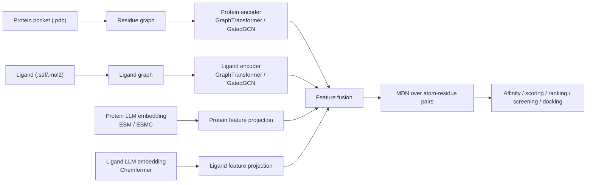

# BioLM-Score


BioLM-Score is a research-oriented codebase for protein-ligand binding scoring. It combines protein pocket graphs, ligand molecular graphs, and large biological model embeddings for affinity prediction and downstream evaluation on CASF-2016 `scoring`, `ranking`, `screening`, and `docking` tasks.

This repository is closer to an experiment-reproduction project than a polished software package. The core training and evaluation logic is present, but several scripts still assume local absolute paths, legacy project names, and precomputed external features. This README is meant to help you understand the codebase quickly and get it running with minimal confusion.

## Highlights

- Residue-level protein pocket graph representation
- Atom- and bond-level ligand graph representation
- Fusion of protein language model embeddings with pocket graph features
- Fusion of Chemformer ligand embeddings with molecular graph features
- Two interchangeable graph encoders: `GraphTransformer` and `GatedGCN`
- Mixture density network (MDN) for atom-residue distance modeling
- Auxiliary atom-type and bond-type prediction losses
- Training, CASF-2016 evaluation, virtual screening, and docking scripts

## Model Overview



## What the Model Uses

- Protein node feature dimension: `41`
- Protein edge feature dimension: `5`
- Ligand node feature dimension: `41`
- Ligand edge feature dimension: `10`
- Protein embedding dimension: `1152`
- Ligand embedding dimension: `1024`

These dimensions are defined in [BioLM_Score/model/model4.py](./BioLM_Score/model/model4.py) and [BioLM_Score/feats/mol2graph_rdmda_res.py](./BioLM_Score/feats/mol2graph_rdmda_res.py).

## Repository Structure

```text
BioLM-Score/
|-- BioLM_Score/
|   |-- data/                   # Dataset wrappers for PDBbind and VS-style inference
|   |-- feats/                  # Pocket extraction, graph construction, molecule preprocessing
|   `-- model/                  # Encoders, fusion model, training utilities
|-- chemformer/                 # Local Chemformer code and ligand feature scripts
|-- esm3/                       # Local ESM/ESMC-related code and pocket embedding scripts
|-- scripts/
|   |-- train_model.py
|   |-- casf2016_scoring_ranking.py
|   |-- casf2016_screening.py
|   |-- casf2016_docking.py
|   |-- docking_scripts.py
|   `-- docking_utils.py
`-- README.md
```

## Installation

Create the tested Conda environment from the root-level environment file:

```bash
conda env create -f environment.yml
conda activate biolm
```

Install the bundled Chemformer code when regenerating ligand embeddings:

```bash
pip install -e ./chemformer
```

## Data Preparation

### Expected training files

The training script `scripts/train_model.py` expects the following files:

```text
<data_dir>/
├─ <data_prefix>_ids.npy
├─ <data_prefix>_prot.pt
└─ <data_prefix>_lig.pt
```

Where:

- `<data_prefix>_ids.npy` stores sample IDs, and may also include labels
- `<data_prefix>_prot.pt` stores a list of protein-pocket `torch_geometric.data.Data` objects
- `<data_prefix>_lig.pt` stores a list of ligand `torch_geometric.data.Data` objects

### Expected embedding files

The model also depends on precomputed external embeddings:

```text
protein_embeddings/
└─ pocket_embeddings/
   ├─ 1abc.npy
   ├─ 2def.npy
   └─ ...

ligand_embeddings/
├─ 1abc.npy
├─ 2def.npy
└─ ...
```

- Protein embedding filenames are matched by `pdbid.npy`
- Ligand embedding filenames are also matched by `pdbid.npy`
- Variable-length residue and atom embeddings are padded during batching

ESM-C and Chemformer are fixed offline feature extractors and are not included in the scorer training graph. Their per-complex `float32` NumPy arrays are precomputed on disk and loaded into host memory by the dataset. The 1,152-dimensional protein and 1,024-dimensional ligand embeddings are projected through `1152 -> 512 -> 128` and `1024 -> 512 -> 128` networks, respectively.

### Time-split IDs

The exact time-split files used in the reported experiments are provided in [`BioLM_Score/data`](./BioLM_Score/data):

- [`train_ids.txt`](./BioLM_Score/data/train_ids.txt): 16,014 complexes
- [`val_ids.txt`](./BioLM_Score/data/val_ids.txt): 942 complexes
- [`casf_excluded_ids.txt`](./BioLM_Score/data/casf_excluded_ids.txt): 285 CASF-2016 complexes excluded from model selection

### Build protein and ligand graphs

You can use [BioLM_Score/feats/mol2graph_rdmda_res.py](./BioLM_Score/feats/mol2graph_rdmda_res.py) to convert processed complexes into graph files:

```bash
python BioLM_Score/feats/mol2graph_rdmda_res.py \
  --dir /path/to/pdbbind_processed \
  --cutoff 10 \
  --outprefix /path/to/output/v2020_train
```

This produces:

- `v2020_train_ids.npy`
- `v2020_train_prot.pt`
- `v2020_train_lig.pt`

### Generate protein pocket embeddings

[esm3/get_pocket_embs_pipeline.py](./esm3/get_pocket_embs_pipeline.py) is used to extract protein sequence embeddings and then select the residues belonging to the pocket.

Before running it, you will likely need to edit:

- `root_dir`
- `out_path`
- pretrained model loading logic
- pocket file naming assumptions

### Generate ligand embeddings

[chemformer/get_canonical_smiles_feat_pipeline.py](./chemformer/get_canonical_smiles_feat_pipeline.py) is used to extract atom-level ligand embeddings from Chemformer.

Before running it, you will likely need to edit:

- `model_path`
- `root_dir`
- `out_path`

## Training

The main training entry point is [scripts/train_model.py](./scripts/train_model.py).

### Example

```bash
python scripts/train_model.py \
  --data_dir /path/to/train_data3 \
  --data_prefix v2020_train \
  --model_path outputs/biolm_score_gt.pth \
  --encoder gt \
  --batch_size 64 \
  --num_epochs 2000 \
  --hidden_dim0 128 \
  --hidden_dim 128 \
  --dist_threhold 7 \
  --dist_threhold2 5
```

### Important arguments

- `--encoder`: `gt` or `gatedgcn`
- `--model_path`: checkpoint output path
- `--data_dir`: directory containing graph files
- `--data_prefix`: dataset prefix, such as `v2020_train`
- `--finetune`: continue training from an existing checkpoint
- `--original_model_path`: pretrained checkpoint path for finetuning
- `--log_dir`: TensorBoard log directory

### Training objective

The final training objective combines:

- MDN distance modeling loss
- affinity-related correlation term
- auxiliary atom-type classification loss
- auxiliary bond-type classification loss

The implementation lives in [BioLM_Score/model/utils2.py](./BioLM_Score/model/utils2.py).

## Pretrained checkpoints

The BioLM-Score and reproduced GenScore checkpoints are available from [Zenodo](https://doi.org/10.5281/zenodo.21878818). Files beginning with `mm` are BioLM-Score checkpoints; files without that prefix are GenScore checkpoints. `gatedgcn_1.0_01.pth`, for example, is the first joint-trained GenScore GatedGCN checkpoint with affinity weight alpha = 1, while `mmgatedgcn_1.0_01.pth` is its BioLM-Score counterpart.

## Evaluation

Use `--model_type biolm` for `mm*` checkpoints and `--model_type genscore` for the corresponding reproduced GenScore checkpoints. No checkpoint conversion is required.

### CASF-2016 scoring and ranking

```bash
python scripts/casf2016_scoring_ranking.py \
  --model_path /path/to/mmgatedgcn_1.0_01.pth \
  --model_type biolm \
  --encoder gatedgcn \
  --outprefix biolm_score
```

For the reproduced GenScore checkpoint:

```bash
python scripts/casf2016_scoring_ranking.py \
  --model_path /path/to/gatedgcn_1.0_01.pth \
  --model_type genscore \
  --encoder gatedgcn \
  --outprefix genscore
```

### CASF-2016 screening

```bash
python scripts/casf2016_screening.py \
  --model_path /path/to/mmgatedgcn_1.0_01.pth \
  --model_type biolm \
  --encoder gatedgcn \
  --outprefix biolm_score
```

### CASF-2016 docking

```bash
python scripts/casf2016_docking.py \
  --model_path /path/to/mmgatedgcn_1.0_01.pth \
  --model_type biolm \
  --encoder gatedgcn \
  --outprefix biolm_score
```
